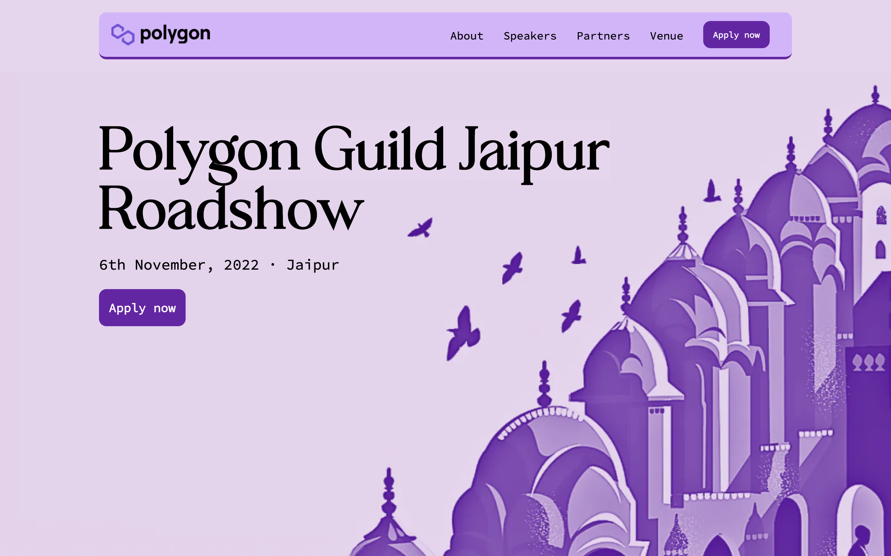

# <a href="https://polygon-roadshow.vercel.app/">POLYGON</a>

### `Polygon Roadshow`
<br>
</img>
<br>

<!-- <a href="https://www.youtube.com/watch?v=rJpA7ulK2rQ" target="_blank" >
 
</a> -->

<!-- <br> -->

<hr>
<hr>


# Project Description

This is a landing page designed and developed for the Polygon Roadshow event.

<br>

<hr>
<hr>

# Technologies Used


<br>
<hr>
<hr>

<!-- <br> -->

# Set Up

### Clone the repo.

```
git clone https://github.com/${GitHub Username}/polygon-roadshow.git
```

<br>

### Open Terminal on the Folder

```
cd polygon-roadshow
```

<br>

### Install the Dependencies

```
npm install
```

<br>

### Run the UI

```
npm run dev
or
yarn start
```

<br>
<hr>
